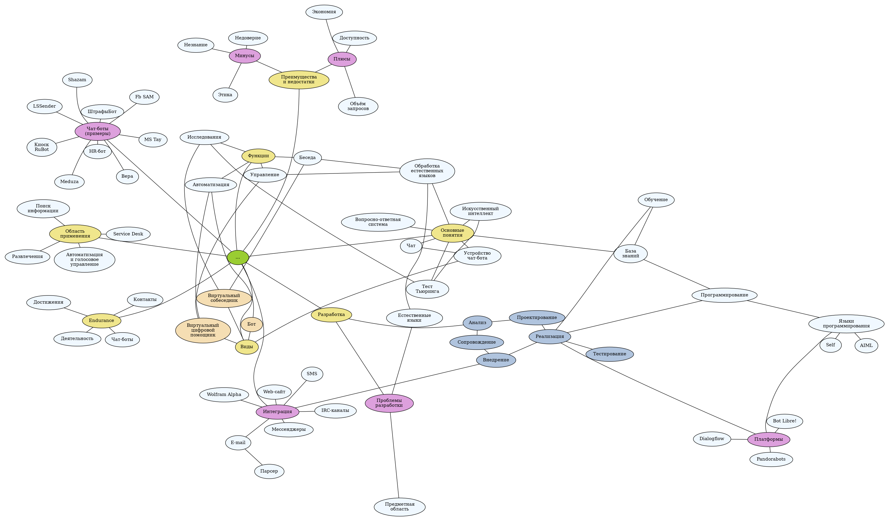

# Botabout

Чат-бот, который ориентирован на информационную поддержку по теме самих чат-ботов.

## Разработка чат-бота

### Семантика предметной области

При проектировании предметной области был построен семантический граф:

## [Bot Libre!](botlibre/)

Первая из рассмотренных платформ для создания чат-ботов.

